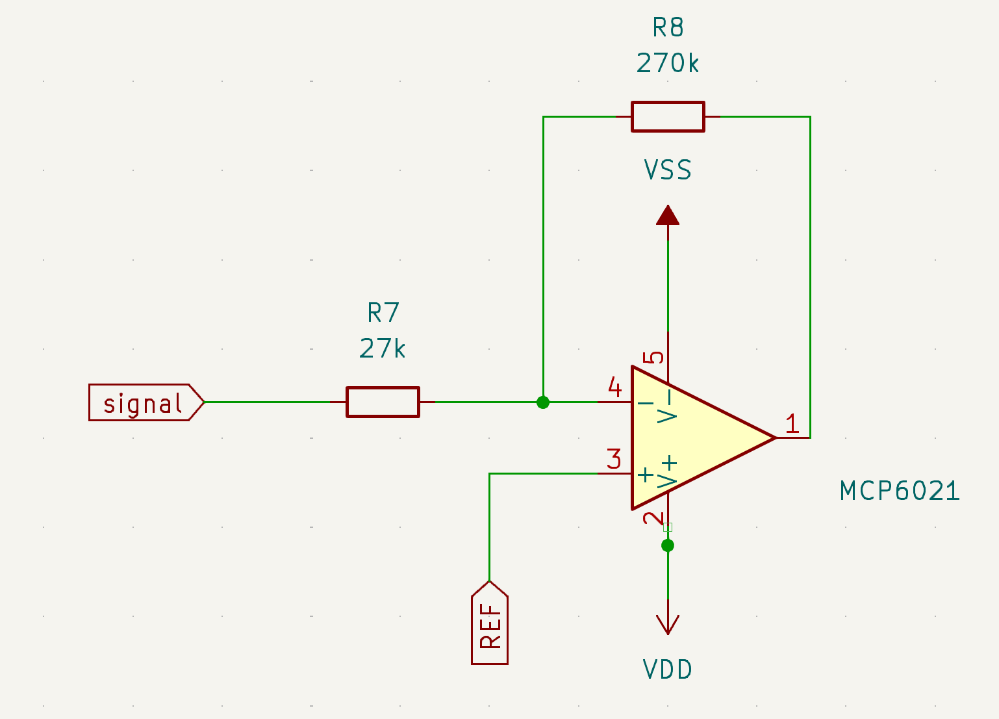
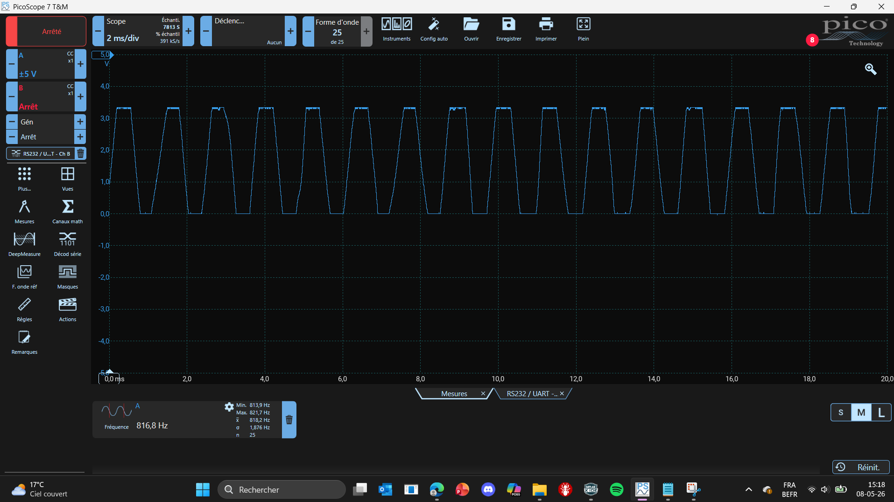

## Rôle
 
Amplifier le signal filtré avant numérisation par l'ADC du microcontrôleur.
 
---
 
## Schéma
---

---
## Composants
 
| Composant | Valeur | Rôle |
|---|---|---|
| R7 | 27 kΩ | Résistance d'entrée |
| R8 | 270 kΩ | Résistance de feedback |
| IN+  | REF = 1.65 V | Point milieu |
| VDD  | 3.3 V | Alimentation positive |
| VSS  | 0 V | Alimentation négative (GND) |
| Op-amp | MCP6021 | |
 
---
 
## Gain
 
```
Gain = − R8 / R7 = − 270k / 27k = −10 
```

 
---
 
 
## Alimentation
 
| Broche | Tension |
|---|---|
| VDD | 3.3 V |
| VSS  | 0 V (GND) |
| REF (IN+) | 1.65 V |
 
## sortie 
---

---
On est en saturation quand on est très proche, mais ça ne pose pas de problème pour l'ADC