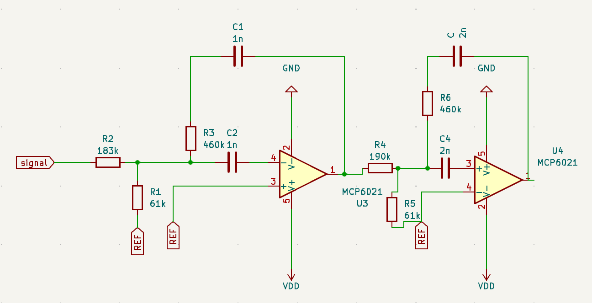
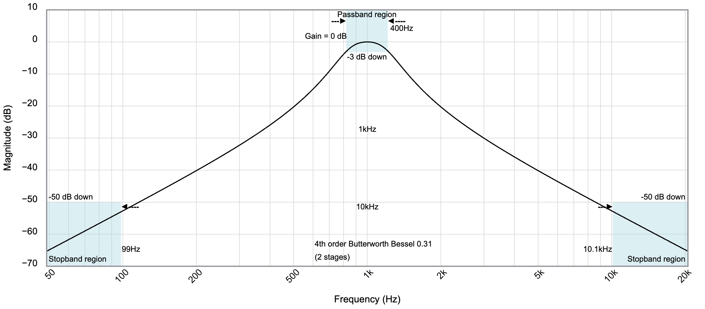

### Schéma
---

---

### Rôle
- Sélectionner uniquement les fréquences utiles (800 Hz et 1200 Hz)
- Rejeter fortement les fréquences parasites
- Éviter le repliement spectral avant l'ADC (fe = 10 kHz)

### Amplificateur 2
| Composant | Valeur | Rôle |
|---|---|---|
| R_entrée | 83.8 kΩ | Résistance d'entrée |
| R_feedback | 757 kΩ | Résistance de feedback |
| C1, C2 | 1.3 nF | Condensateurs du filtre |
| R_Ref | 18.1 kΩ | R vers REF |
| Op-amp | MCP6021 | Très faible consommation |

### amplificateur 3
| Composant | Valeur | Rôle |
|---|---|---|
| R_entrée | 80.5 kΩ | Résistance d'entrée |
| R_feedback | 727 kΩ | Résistance de feedback |
| C1, C2 | 1.8 nF | Condensateurs du filtre |
| R_Ref | 17.4 kΩ | R vers REF |
| Op-amp | MCP6021 | faible bruit et grand GBW |

### Caractéristiques du filtre
| Paramètre | Valeur |
|---|---|
| Fréquence centrale | 1 kHz |
| Bande passante (-3 dB) | 400 Hz |
| Type | 4ème ordre (initialement Butterworth, modifié vers Butterworth-Bessel) |

### Stabilité du circuit

Initialement, un filtre purement Butterworth avec un gain de 20 dB avait été mis en place. Cela engendrait des grosses perturbations, dû soit à une rétroaction positive à cause du déphasage introduit par les différents étages, soit par le bruit blanc entre 800 et 1200Hz

---

---

Solution appliquée : modification des pôles du filtre pour se rapprocher d'un filtre de **Bessel**, qui offre une meilleure stabilité de phase au détriment d'une coupure moins franche.

---

---
Voici la courbe de Bode final. Contrairement à l'ancienne version, il n'y a plus le gain. La phase ajouté au niveau du 800 et 1200 Hz est de 50°, ce qui fait que le circuit reste stable.